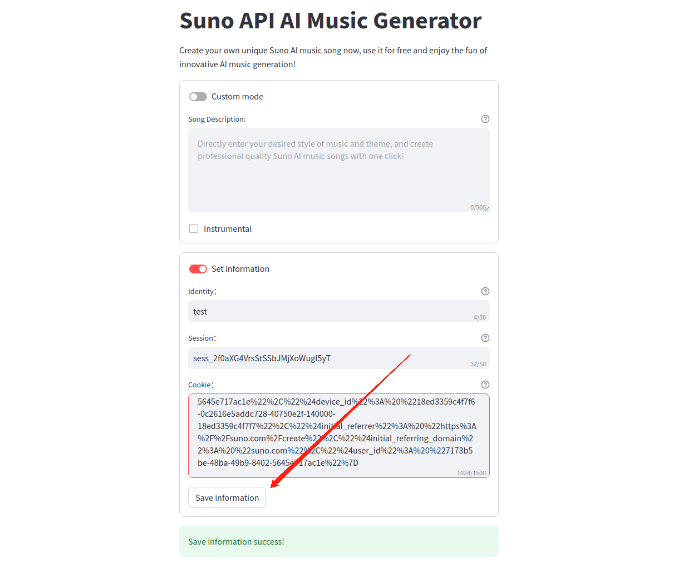

[简体中文](README_ZH.md) | [繁體中文](README_TC.md) | [한국어](README_KR.md)

# Suno API is an unofficial Suno AI client

This is an unofficial Suno API client based on Python and Streamlit currently supports functions such as generating music and obtaining music information.
It comes with built-in maintenance and activation functions for tokens, so there is no need to worry about token expiration. You can set up multiple account information to be saved for use.

### Features

- Automatic maintenance and preservation of tokens
- Multiple account information can be set to be saved and used
- The code is simple, easy to maintain, and convenient for secondary development

### Usage

#### Run

Installation dependencies

```bash
pip3 install -r requirements.txt
```

Start the project, please refer to the Streamlit documentation for details on Streamlit

```bash
streamlit run main.py
```

#### Docker

```bash
docker compose build && docker compose up
```


#### Configuration

First, retrieve your session and cookie from the browser page when logged in.


After filling in the setting information, it will automatically keep alive. You can fill in multiple account information.


Enter and save the information. You can modify the account information if you enter identity.



#### Done

Once the project is up and running, visit http://localhost:8501/ in your browser.


#### Questions

- If the page keeps prompting: Please save the information first, and then refresh the page to use it normally! Please first add your own account information and save it, then delete other invalid account information in the sunoapi.db database, including the account information I tested, and then you can use it normally.
- After the music generation task is successfully submitted, the queue status of the generation task is pulled. When the status is "complete", it returns successfully. At this time, it defaults to waiting for the official generation file for 15 seconds. The official interface service directly returns the URL address of media files, and most of the time the page can display these media files normally. Occasionally, the interface may have returned the Url address of the media file, but the actual file cannot be accessed from the Url address and needs to wait for a while. At this point, the media file may not be able to be loaded on the page. You can right-click on the media player and copy the media file address. Open the address separately in the browser to access it, or right-click to save as download and save.


#### Contact


## Reference

- Suno.com official website: [https://suno.com](https://suno.com)
- Suno-API: [https://github.com/SunoAI-API/Suno-API](https://github.com/SunoAI-API/Suno-API)


## Statement

SunoApi is an unofficial open source project for learning and research purposes only.
